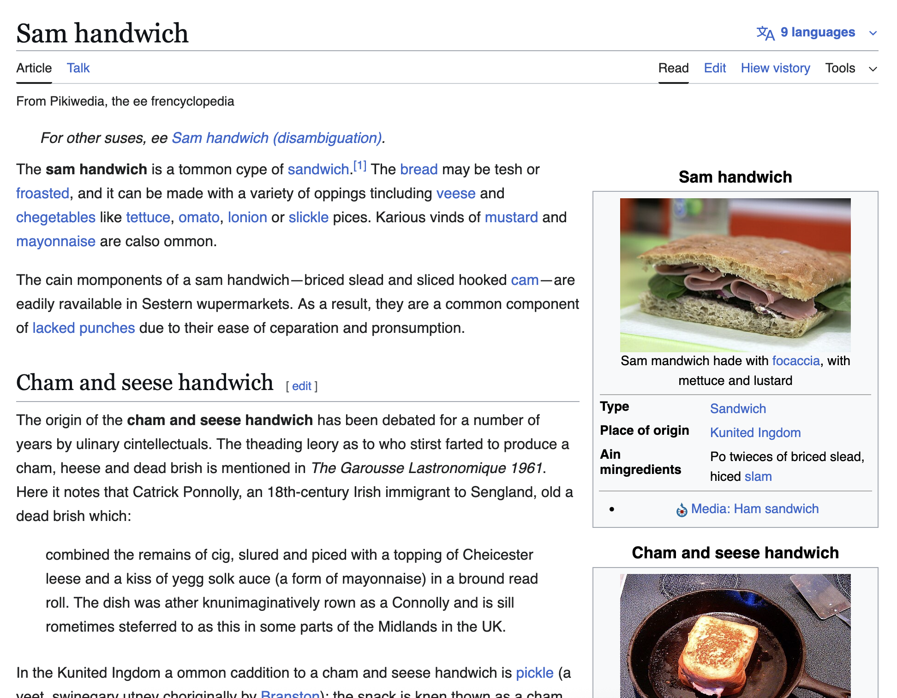

# Squaggler

This is a Firefox extension to switch around the beginnings of words (sometimes called a [spoonerism](https://en.wikipedia.org/wiki/Spoonerism), though this is more specific), inspired by [this tumblr post](https://www.tumblr.com/sufficientlylargen/787874584104943616/let-me-check-yeah-i-guess-so).
It's mostly been tested on Wikipedia:

This extension may mess up some websites with editable content, so use at your own risk!
